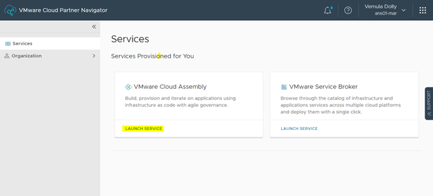
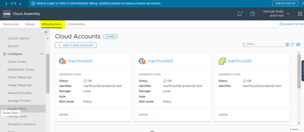
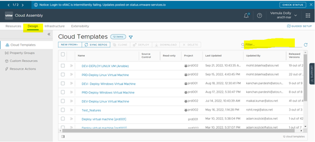
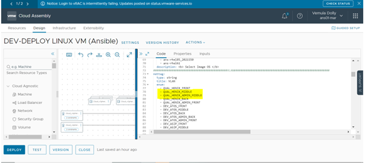
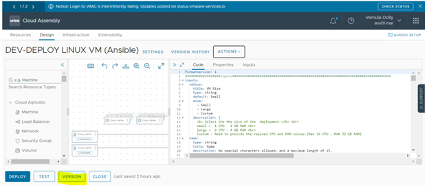
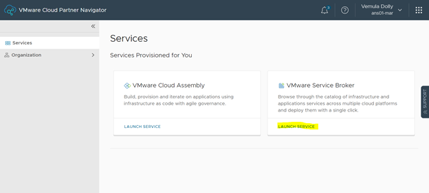
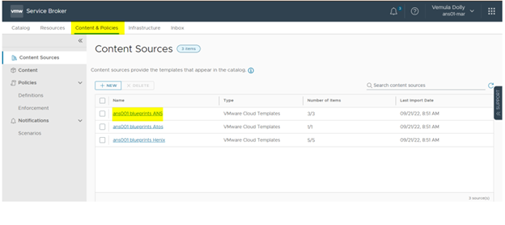
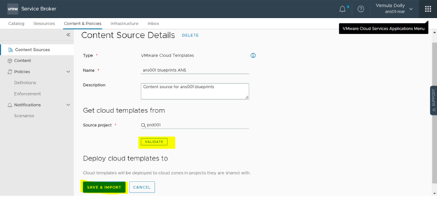
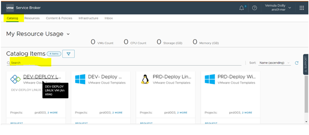
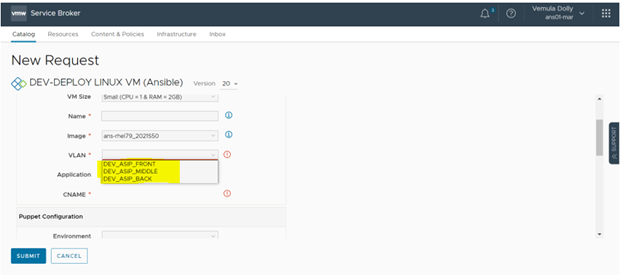

# Adding new VLAN in ANS - MAR CLY

Table of Contents
- [Changelog](#Changelog)
- [Introduction](#Introduction)
- [Purpose](#Purpose)
- [Scope](#Scope)
- [Prerequisites](#Prerequisites)
- [Stages For Adding VLAN](#Stages-For-Adding-Puppet-Roles)
- [Add the VLAN in ANS-MAR CLY](#Add the VLAN in ANS-MAR CLY)

# Changelog
  
| Version | Date       | Description              | Author       |
| ------- | ---------- | ------------------------ | --------------- |
|  0.1    | 21/09/2022 |   Add VLAN in ANS - MAR CLY           | Dolly Vemula |

# Introduction

## Purpose

The purpose of this document is to describe steps that should be performed to Add new VLAN in ANS - MAR and CLY.
## Scope

The scope of this document covers the following:

  - Updating/Adding New VLAN in the ANS - MAR CLY.

## Prerequisites
    
  -  Access to the both ANS - MAR , CLY in VRA Environment.
     
# Steps for Adding VLAN in ANS - MAR CLY

To Update/Add New VLAN we need to follow 3 main steps:

   - Step1:  We need to check the Required VLAN is Available in the Network Profile and check the tags.

   - Step2: Need to Update\add the VLAN in Cloud Assembly.

   - Step3: Verify in the service broker weather the VLAN is added or not.
 
# Add the VLAN in ANS-MAR CLY

## Step 1

## updating/add VLAN Process in ANS - MAR CLY

  ## 1.1 Sign in VRA Environment
 
    First log on to VRA.

      - Then click the cloud assembly.

  ## 1.3 Verify VLAN is in the Network profile

     -click on the Infrastructure.

  ## 1.3 Verify the Tags are Updated

     - Click on the Network Profile and search for the Required VLAN is available or not.

     - If the VLAN is not available then we need to add the required VLAN in the network profile and need to add the network tags.

## Step 2

## Update VLAN in the Cloud Assembly

   ## 2.1 select required Template

     - Click on the Design and select/search for the required Blueprint.

   
   ## 2.2 Add required VLAN  in the Template

     - Now need to add the VLAN in the Blueprint.

 
   ## 2.3 Version the Blueprint.

    - click on the version button in the blueprint.
   

   
## step 3

## Verification in Service Broker

  ## 3.1 In Service Broker

      - Click on the service broker.

         
  ## 3.2 project in Content&Policies

     - In service broker click on the content&policies and then select the project.

         
  ## 3.3 Validation in conten&Policies

     - Click on the validate and then save & import.

  ## 3.4 Select Catalog 

     - In the service broker click on the catalog and search/select the required catalog.

  ## 3.5 Verify VLAN in the Catalog

     - Now check the VLAN is added in the Catalog.

