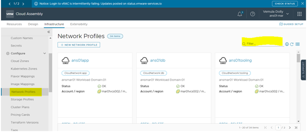

# Adding new VLAN in ANS - MAR CLY

- Table of Contents
{:toc}

# Changelog
  
| Version | Date       | Description              | Author       |
| ------- | ---------- | ------------------------ | --------------- |
|         | 21/09/2022 |                          | Dolly Vemula |

# Introduction

## Purpose

The purpose of this document is to describe steps that should be performed to Add new VLAN in ANS - MAR and CLY.
## Scope

The scope of this document covers the following:
Updating/Adding New VLAN in the ANS - MAR CLY.

# Bringup Process

## Update/Add the VLAN in ANS-MAR CLY

To Update/Add New VLAN we need to follow 3 main steps:

Step1:  We need to check the Required VLAN is Available in the Network Profile and check the tags.

Step2: Need to Update\add the VLAN in the Required Blueprint.

Step3: Verify in the service broker weather the VLAN is added or not.

For updating/add VLAN first log on to VRA service Broker.

Then click the cloud assembly.

Then click on the Infrastructure.

Click on the Network Profile and search for the Required VLAN is available or not.

If the VLAN is not available then we need to add the required VLAN in the network profile and need to add the network tags.

Click on the Design and select/search for the required Blueprint.

